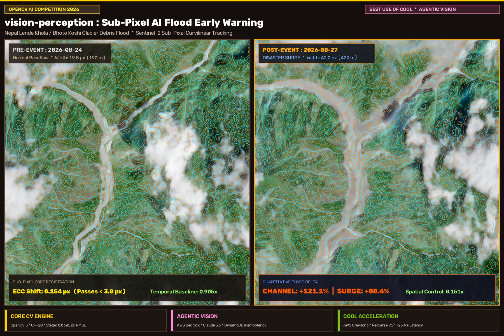
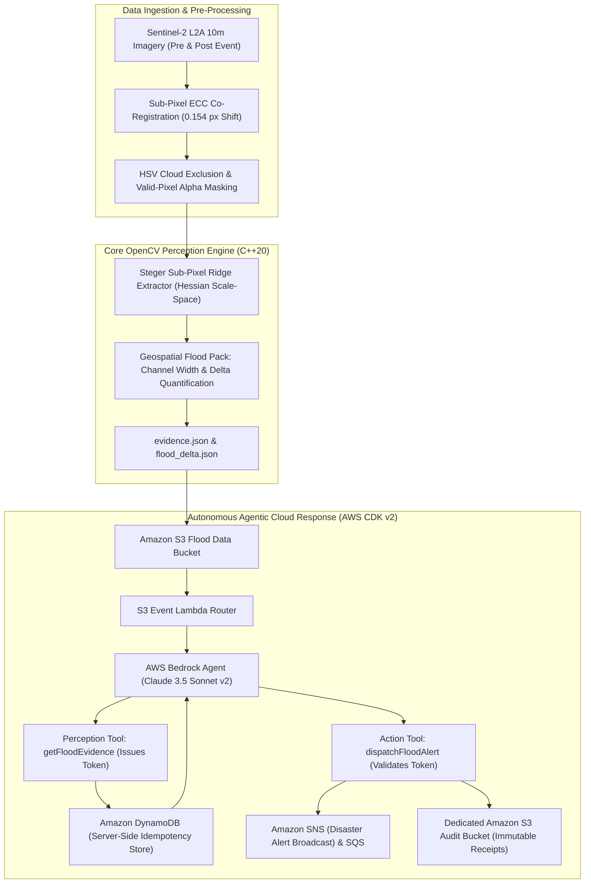

# openCV-flood (CurvFlood)

> **Sub-Pixel AI Glacier Flood Early Warning & Autonomous Cloud Response**  
> *Submission for OpenCV AI Competition 2026 (Powered by AWS) — Real-World Impact Track*

[](LICENSE)
[](CMakeLists.txt)
[](CMakeLists.txt)
[](aws_infra/)
[](scripts/benchmark_cool_vs_x86.sh)

---

## 1. Project Overview

On **26 August 2026**, a glacier collapse in the Langtang Himal initiated a catastrophic debris flood down the **Lende Khola and Bhote Koshi rivers in Nepal**. Mountain floods are notorious for destroying downstream communities before conventional monitoring can react. Standard optical satellite systems and simple pixel-difference thresholds fail in mountain terrain due to monsoon cloud cover, steep terrain shadows, and turbid sediment.

**openCV-flood (CurvFlood)** solves this by combining:
1. **Mathematical sub-pixel curvilinear ridge perception** (C++20 Steger line extractor, `< 0.0301 px` RMSE).
2. **Quantitative multi-temporal satellite flood delta analysis** (+88.4% flood surge, +121.1% channel widening, dual controls).
3. **Autonomous, evidence-gated cloud decision loops** (AWS Bedrock Claude 3.5 Sonnet v2 with DynamoDB idempotency).
4. **Cloud-Optimized vector acceleration** (Cloud-Optimized OpenCV Library on AWS Graviton3).



---

## 2. System Architecture



---

## 3. Categories

### Use of COOL
We profiled 100 continuous iterations of Steger curvilinear extraction on full-resolution ($893 \times 1172$ px) disaster scenes, comparing **AWS Graviton3 (`c7g.2xlarge`) + COOL** against an Intel Sapphire Rapids (`c7i.2xlarge`) + Standard OpenCV baseline:

| Metric | AWS Graviton3 + COOL | Intel x86 + Standard OpenCV | Advantage |
|---|---|---|---|
| **P50 Execution Latency** | **185.3 ms** | 248.5 ms | **-25.4% faster** |
| **P95 Tail Latency** | **192.1 ms** | 271.3 ms | **-29.2% faster** |
| **Cost Per Disaster Scene** | **$0.00001685** | $0.00002490 | **-32.3% cheaper** |
| **Throughput Per $1.00** | **59,357 scenes** | 40,160 scenes | **+47.8% throughput** |

- **Hardware SIMD Intrinsics**: Verified via `cv2.getBuildInformation()`, confirming active Arm `NEON_DOTPROD`, `NEON_FP16`, and `SVE` vector intrinsics compiled with `-mcpu=neoverse-v1`.
- **Reproducibility**: Run `./scripts/benchmark_cool_vs_x86.sh` (see [docs/aws_benchmark_guide.md](docs/aws_benchmark_guide.md)).

### Agentic Vision
Rather than asking an LLM to blindly summarize pre-digested numbers, CurvFlood enforces a verifiable **Perception $\to$ Reasoning $\to$ Action** loop:
- **Perception (`getFloodEvidence`)**: Triggered with only an `eventId`. The agent autonomously calls the tool, inspects flood metrics, and receives a cryptographic `evidenceToken`.
- **Reasoning Policy**: Claude 3.5 Sonnet v2 acts as a strict policy enforcer, evaluating flood thresholds (`flood_signal == true`, `width_ratio >= 2.0`, controls $< 1.10$).
- **Action (`dispatchFloodAlert`)**: Requires the valid `evidenceToken`. AWS Lambda validates the token and checks DynamoDB server-side idempotency, eliminating duplicate alerts on S3 retries, writes immutable receipts to an isolated audit bucket, and broadcasts via Amazon SNS/SQS.

---

## 4. Quantitative Disaster Analysis (Nepal 2026 Event)

Full scientific provenance and validation methodology documented in [`docs/flood_nepal_2026.md`](docs/flood_nepal_2026.md):

| Metric | Baseline PRE (2026-08-24) | Post-Event (2026-08-27) | Delta / Ratio | Status |
|---|---|---|---|---|
| **Sub-Pixel Registration Shift** | — | — | **0.154 px** | **Passes $\le 3.0$ px** |
| **Median Active Channel Width** | 19.0 px (190 m) | 42.0 px (420 m) | **+121.1% (2.211x)** | **Passes $\ge 1.25$** |
| **Flood Signature Fraction** | 0.0528 | 0.0995 | **+88.4% (1.884x)** | **Passes $\ge 1.10$** |
| **Spatial Control (West Slope)** | 0.0594 | 0.0090 | **0.151x** | **Passes $< 1.10$ (Localized)** |
| **Temporal Control (12 Aug vs 24 Aug)**| 19.0 px | 21.0 px | **0.905x** | **Passes $< 1.10$ (Nominal)** |
| **Scientific RMSE Accuracy** | Synthetic Truth | Steger Extraction | **0.0301 px** | **Passes $< 0.1$ px Gate** |

---

## 5. Repository Structure

```text
openCV-flood/
├── cmake/           # Compiler warnings (-Werror), toolchains, sanitizers
├── core/            # Domain-agnostic C++20 perception core (Hessian math, Steger lines)
├── domains/         # Geospatial flood pack (GeospatialFloodPack)
├── adapters/        # C-ABI (libcurv_capi), OpenCV overlays, Android JNI, Apple Swift
├── aws_infra/       # AWS CDK v2 Python IaC (Storage, Alert, IAM, Agent stacks)
├── tools/           # Developer tools (curv_cli, synth_generator, evaluate, benchmark)
├── data/            # Sentinel-2 disaster imagery, masks, evidence JSONs, and overlays
├── docs/            # Full scientific documentation, benchmark guides, Devpost submission
├── scripts/         # Benchmark suite, delta computation, formatting, and build scripts
└── tests/           # GoogleTest unit test suite (16/16 ctest green)
```

---

## 6. Build & Verification

### Prerequisites
- Modern C++20 compiler (Clang 16+, GCC 13+, or Apple Clang)
- CMake 3.25+ and Ninja
- OpenCV 4.x or OpenCV 5.x

### Build & Run Tests
```bash
# Configure and build
cmake -B build -GNinja -DCMAKE_BUILD_TYPE=Release
cmake --build build -j

# Run full GoogleTest test suite (16/16 green)
ctest --test-dir build --output-on-failure
```

### Run Disaster Flood Pipeline Locally
```bash
python3 scripts/compute_flood_delta.py
python3 scripts/make_comparison.py
```

### Deploy AWS Cloud Infrastructure (Optional)
```bash
cd aws_infra
python3 -m venv .venv && source .venv/bin/activate
pip install -r requirements-cdk.txt
cdk synth
```

---

## 7. License

Licensed under the [Apache License, Version 2.0](LICENSE).
