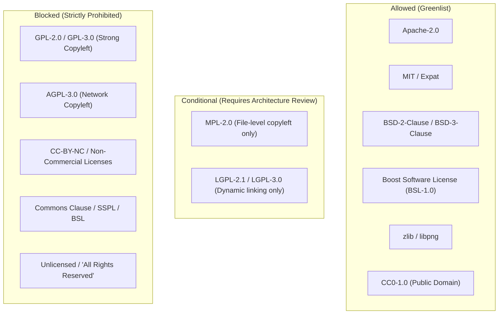

# Software Licensing and IP Provenance Policy

> **Target Repository**: `vision-perception`  
> **Effective Date**: September 2026  
> **Status**: Active Governance Policy  

---

## 1. Purpose & Scope

This document establishes the mandatory intellectual property (IP), licensing, and provenance governance rules for the `vision-perception` monorepo. 

As a reusable, production-grade computer vision core designed for multi-platform deployment (embedded, mobile iOS/Android, desktop, and cloud edge) across commercial products, the repository must maintain an uncompromised IP posture.

All contributors, engineers, and automated agents contributing to this repository must adhere strictly to the policies defined herein.

---

## 2. License Classification

Every software package, external dependency, header file, code snippet, and model artifact integrated into `vision-perception` falls into one of three classifications:



### 2.1. Allowed Licenses (Greenlist)
Components under these licenses may be consumed, linked statically or dynamically, compiled, and bundled into proprietary binary deliverables without compromising commercial IP:

- **Apache License 2.0 (`Apache-2.0`)**: Strongly preferred; includes explicit patent grants and trademark protections.
- **MIT License (`MIT`)**: Fully approved.
- **BSD 2-Clause ("Simplified") & BSD 3-Clause ("Modified") (`BSD-2-Clause`, `BSD-3-Clause`)**: Fully approved.
- **Boost Software License 1.0 (`BSL-1.0`)**: Fully approved for header-only and static components.
- **zlib/libpng License (`Zlib`)**: Fully approved.
- **Creative Commons Zero 1.0 Universal (`CC0-1.0`)**: Fully approved.

### 2.2. Conditional Licenses (Yellowlist - Mandatory Review)
These licenses have specific restrictions that can create legal exposure if used improperly:

- **Mozilla Public License 2.0 (`MPL-2.0`)**: Allowed **only** if the third-party source files remain completely unmodified in a dedicated directory or separate compilation unit. Any modifications to an MPL-licensed file must be published.
- **GNU Lesser General Public License (`LGPL-2.1`, `LGPL-3.0`)**:
  - **Static Linking: STRICTLY FORBIDDEN**.
  - **Dynamic Linking (.so / .dylib / .dll): CONDITIONAL**. Allowed only if dynamically linked at the OS level such that an end user can replace the LGPL library without relinking proprietary object code. Avoid entirely in mobile applications (iOS App Store restrictions) or embedded firmware.

### 2.3. Blocked Licenses (Redlist - Strictly Prohibited)
The following licenses must **NEVER** be committed, vendored, statically linked, or included in any compilation unit:

- **GNU General Public License (`GPL-2.0`, `GPL-3.0`)**: Viral copyleft forces disclosure of proprietary source code.
- **Affero General Public License (`AGPL-3.0`)**: Triggers source disclosure even across network interfaces.
- **Non-Commercial / Research-Only Licenses (`CC-BY-NC-*`, PolyForm Noncommercial, academic-only)**: Prohibits enterprise commercial exploitation.
- **Source-Available / Anti-Cloud Licenses (`SSPL`, `BSL 1.1`, Commons Clause)**: Restrictive commercial terms.
- **Unlicensed Code**: Code found on public websites, StackOverflow, or GitHub repositories without an explicit open-source license file is legally protected by default copyright ("All Rights Reserved") and must not be used.

---

## 3. Machine Learning Model Weight Policy

Machine learning models comprise two distinct intellectual property assets: (1) the model architecture code, and (2) the learned binary weights/biases.

1. **Explicit Model Licensing**:
   - Every model stored in or referenced by `models/` must possess an associated `manifest.json` documenting the model architecture license, training dataset pedigree, and binary weights license.
2. **Permissible Weight Sources**:
   - Models trained in-house from synthetic or legitimately licensed proprietary data.
   - Models released under Apache-2.0, MIT, or public domain (e.g., Google AI Edge MediaPipe landmark models under Apache-2.0).
3. **Prohibited Weight Sources**:
   - Models trained on datasets governed by non-commercial restrictions (e.g., ImageNet non-commercial terms for commercial deployments, unless clean-room fine-tuned).
   - Models distributed under research-only or non-commercial licenses (e.g., LLaMA-1 non-commercial weights).
4. **Binary Storage Hygiene**:
   - Raw binary weights (`.onnx`, `.tflite`) exceeding 10MB must **not** be committed directly into Git history. They must be fetched on-demand using versioned download scripts in `scripts/download_models.sh` with cryptographic SHA-256 integrity checks.

---

## 4. Third-Party Code Provenance Rules

Any external source code integrated into the repository must be placed exclusively in the `third_party/` directory:

### 4.1. Directory Structure for Vendored Code
```text
third_party/
└── <package_name>/
    ├── PROVENANCE.md         # Mandatory metadata document
    ├── LICENSE                # Exact upstream license text
    └── include/ / src/       # Source code files
```

### 4.2. Mandatory `PROVENANCE.md` Requirements
Each vendored dependency must include a `PROVENANCE.md` containing:
- **Package Name & Version**: e.g., `ttk592-spline v0.1.0`
- **Upstream Repository URL**: e.g., `https://github.com/ttk592/spline`
- **Commit SHA**: Exact Git commit hash of the snapshot.
- **Author & Copyright Holders**: e.g., `Copyright (c) 2014 Tino Kluge`
- **License Type**: e.g., `MIT License`
- **Modifications Log**: An explicit list of all changes, patches, or optimizations made to the upstream code.
- **Review Date & Approver**: Who validated the license and code safety.

---

## 5. Rules for Copying, Adapting, and Implementing Algorithms

### 5.1. Clean-Room Implementation of Academic Literature
When implementing algorithms described in academic papers (e.g., Carsten Steger’s 1998 curvilinear structure detector, Frangi vesselness filter, RORPO, Douglas-Peucker):
1. **Mathematical Derivation**: Implement equations directly from the published paper text and formulas.
2. **Citation**: Add an academic citation to the file docstring:
   ```cpp
   /**
    * @brief Unbiased Curvilinear Ridge Extractor
    * 
    * Implementation based on differential geometric principles described in:
    * Steger, C. (1998). "An Unbiased Detector of Curvilinear Structures".
    * IEEE Transactions on Pattern Analysis and Machine Intelligence, 20(2), 113-125.
    * DOI: 10.1109/34.659930
    */
   ```
3. **No GPL Transcribing**: Engineers must **never** inspect GPL/AGPL-licensed reference implementations while writing core algorithms for `vision-perception`. Implementing an algorithm from paper mathematics is clean-room; copying GPL code line-by-line is copyright infringement.

### 5.2. Online Code Snippets & AI Code Assistance
- Snippets from StackOverflow, AI coding assistants, or personal blogs must be scrutinized for license compatibility. 
- Large blocks of code (>10 lines) copied from external sources must follow the provenance process or be rewritten to follow repository architecture and coding conventions.

---

## 6. Audit & Compliance Enforcement

1. **Pre-Commit / CI Automated Scanning**:
   - Future CI workflows will execute license validation checks to ensure all source files include proper license headers and no redlisted licenses are introduced.
2. **Dependency Tree Audits**:
   - Transitive dependencies brought in by CMake package managers or Conan/vcpkg will be audited to prevent hidden GPL transitive linkage.
3. **Reporting Violations**:
   - If an engineer or agent discovers any questionable license or contaminated code snippet, it must be flagged immediately for removal and clean-room replacement.
