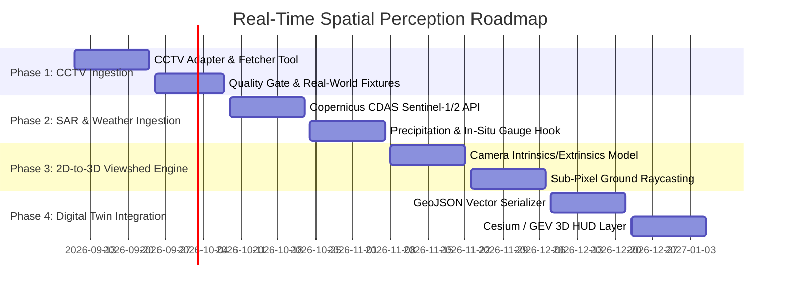

# Real-Time Spatial Perception Architecture & Multi-Source Ingestion

> **Document ID**: `DOC-ARCH-005-REALTIME-SPATIAL`  
> **Target Repository**: `openCV-flood`  
> **Lifecycle Status**: Active Architecture & Research Specification  
> **Scope**: Cross-Source Telemetry & Video Ingestion, Sub-Pixel Perception, and 3D Digital Twin Loop  

---

## 1. System Vision & Problem Statement

The `openCV-flood` codebase provides a high-performance C++20 perception core specializing in sub-pixel differential geometry (Steger curvilinear ridge extraction, Hessian tensor decomposition, and immutable evidence modeling). 

While existing milestones (M1–M8) demonstrated sub-pixel precision on static optical imagery (e.g., ESA Sentinel-2 L2A orthorectified tiles), real-world operational deployments require ingesting **heterogeneous real-time feeds**:
- **Continuous CCTV Video & Snapshots** (DOT traffic feeds, hydropower intake cameras, infrastructure monitors).
- **Periodic Earth Observation (EO) Passes** (Sentinel-1 SAR, Sentinel-2 Multispectral, Landsat-9, PlanetScope).
- **Environmental Telemetry Streams** (In-situ hydrological gauges, USGS seismic alerts, NASA FIRMS thermal vectors, Open-Meteo precipitation).

This architecture unifies external spatial intelligence (drawing architectural patterns from [`bilawalsidhu/gods-eye-view`](https://github.com/bilawalsidhu/gods-eye-view)) with the deterministic C++20 perception pipeline and AWS Bedrock agentic dispatch loop.

---

## 2. Multi-Tier Architecture Diagram

```text
┌───────────────────────────────────────────────────────────────────────────────┐
│                           Tier 1: Ingestion Adapters                          │
│                                                                               │
│  ┌────────────────────┐   ┌────────────────────┐   ┌───────────────────────┐  │
│  │   CCTV Adapter     │   │   Satellite CDAS   │   │  Hydrometeorology     │  │
│  │ (Caltrans/TfL/DHM) │   │ (Sentinel-1/2 WMS) │   │ (DHM/Open-Meteo/USGS) │  │
│  │  HLS/MJPEG/JPEG    │   │ GeoTIFF/COG Tiles  │   │  JSON/REST/WebSockets │  │
│  └─────────┬──────────┘   └─────────┬──────────┘   └──────────┬────────────┘  │
└────────────┼────────────────────────┼─────────────────────────┼───────────────┘
             │ Frame Ring Buffer      │ Ortho-rectified Scenes  │ Telemetry Trigger
             ▼                        ▼                         ▼
┌───────────────────────────────────────────────────────────────────────────────┐
│                       Tier 2: Perception Core (`core/`)                       │
│                                                                               │
│  ┌─────────────────────────────────────────────────────────────────────────┐  │
│  │ Quality Gate: Laplacian Blur, Illumination & Cloud-Exclusion Masking     │  │
│  └────────────────────────────────────┬────────────────────────────────────┘  │
│                                       ▼                                       │
│  ┌─────────────────────────────────────────────────────────────────────────┐  │
│  │ Scale-Space Hessian Second Derivatives (Gaussian Kernels Gxx, Gxy, Gyy) │  │
│  └────────────────────────────────────┬────────────────────────────────────┘  │
│                                       ▼                                       │
│  ┌─────────────────────────────────────────────────────────────────────────┐  │
│  │ Taylor Sub-Pixel Ridge Centerlines & Hysteresis Topological Linking     │  │
│  └────────────────────────────────────┬────────────────────────────────────┘  │
│                                       ▼                                       │
│  ┌─────────────────────────────────────────────────────────────────────────┐  │
│  │ Spatial & Temporal Dual-Control Cross-Validation                        │  │
│  └─────────────────────────────────────────────────────────────────────────┘  │
└───────────────────────────────────────┬───────────────────────────────────────┘
                                        │ Immutable `evidence.json`
                                        ▼
┌───────────────────────────────────────────────────────────────────────────────┐
│                       Tier 3: Dispatch & Cloud Automation                     │
│                                                                               │
│  ┌───────────────────────┐ ┌──────────────────────┐ ┌──────────────────────┐  │
│  │  AWS S3 Audit Vault   │ │ DynamoDB Deduplicator│ │ Bedrock Agent Loop   │  │
│  │   Immutable Records   │ │ Idempotency Control  │ │ Action Groups / SNS  │  │
│  └───────────────────────┘ └──────────────────────┘ └──────────────────────┘  │
└───────────────────────────────────────┬───────────────────────────────────────┘
                                        │ GeoJSON 3D Vector Geometry
                                        ▼
┌───────────────────────────────────────────────────────────────────────────────┐
│                 Tier 4: Presentation & Digital Twin (Cesium / GEV)             │
│                                                                               │
│  • 3D Terrain Extrusion & Dynamic River Frustum                              │
│  • Tactical Sensor Shaders (FLIR / Ironbow, NVG Night Vision)                │
│  • Camera Viewshed 2D-to-3D Back-Projection                                   │
└───────────────────────────────────────────────────────────────────────────────┘
```

---

## 3. Core Use Cases & Phased Roadmap

### 3.1. Primary Use Cases

1. **UC-1: Real-Time Hydrological Flash Flood & GLOF Early Warning**:
   - Ingests river gorge CCTV and upstream Sentinel-1 SAR imagery.
   - Measures river centerline displacement and channel width surges.
   - Dispatches emergency civil defense alerts via AWS Bedrock when widening exceeds critical thresholds ($> 1.25\times$).
2. **UC-2: Highway & Transportation Corridor Infrastructure Monitoring**:
   - Ingests municipal DOT CCTV cameras (e.g., Caltrans I-80 / US-101 corridors).
   - Monitors pavement cracks, rockfall obstacles, and roadway lane boundary degradation using Steger curvilinear extraction.
3. **UC-3: Multi-Sensor Disaster Digital Twin**:
   - Projects 2D vision detections (flood contours, infrastructure damage) onto photorealistic 3D Cesium terrain tiles.
   - Provides an interactive tactical HUD for emergency coordinators.

---

### 3.2. Phased Implementation Roadmap



#### Phase 1: CCTV Ingestion & Robustness Gating (Target: Q3 2026)
- **Goal**: Implement `adapters/cctv/` capable of ingesting snapshot JPEGs and HLS video streams with backpressure control.
- **Deliverables**:
  - `tools/cctv_fetcher.py`: Command-line interface for polling Caltrans, Austin, and international feeds.
  - C++ `curv::adapter::CctvStreamAdapter`: Thread-safe ring-buffer consumer using OpenCV `cv::VideoCapture`.
  - Integration with `curv::quality::LaplacianBlurGate` to drop frames obscured by heavy weather or transmission artifacts.

#### Phase 2: Multi-Spectral & All-Weather SAR Ingestion (Target: Q4 2026)
- **Goal**: Expand EO ingestion beyond manual Sentinel-2 downloads to automated API polling via Copernicus Data Space Ecosystem (CDAS).
- **Deliverables**:
  - `adapters/satellite/cdas_client.py`: Automated retrieval of Cloud-Optimized GeoTIFFs (COG).
  - Sentinel-1 SAR pre-processing pipeline (Lee filter speckle suppression, VV/VH polarization ratio).
  - Correlating satellite passes with in-situ water level sensors (e.g., DHM Nepal gauge telemetry).

#### Phase 3: Spatial Viewshed & Metric Ground Projection (Target: Q4 2026 / Q1 2027)
- **Goal**: Transition from 2D pixel coordinates $(u, v)$ to real-world metric WGS84 coordinates $(X, Y, Z)$ on digital elevation models.
- **Deliverables**:
  - `core/geometry/CameraPose.hpp`: Extrinsics (heading, pitch, roll, altitude) and intrinsics (focal length, sensor dimension, FOV).
  - Planar homography and ray-casting utilities to measure physical ground distances (meters) directly from CCTV perspective views.

#### Phase 4: Bi-Directional 3D Digital Twin Integration (Target: Q1 2027)
- **Goal**: Close the loop between C++ perception and browser-based 3D tactical visualization.
- **Deliverables**:
  - `core/evidence/GeoJsonExporter.cpp`: Exports sub-pixel polylines as standard OGC GeoJSON.
  - CesiumJS integration module compatible with `gods-eye-view` for real-time tactical layer rendering.

---

## 4. Key Architectural Patterns

### 4.1. Thread-Safe Ring-Buffer Frame Ingestion
To decouple slow, variable-latency network streaming from real-time C++ inference:
- Network worker thread writes incoming frames to a fixed-capacity circular buffer ($N=16$ slots).
- Perception worker thread consumes the latest available frame, dropping stale intermediate frames (Zero Latency Accumulation).
- Lock-free atomic head/tail pointers guarantee determinism.

### 4.2. Immutable Evidence Chain
Every frame processed through the pipeline outputs an immutable `PerceptionEvidence` JSON block containing:
1. **Frame Metadata**: UTC timestamp, camera ID, GPS location, source URL/hash.
2. **Quality Audit**: Laplacian blur variance score, illumination histogram, cloud fraction.
3. **Geometric Vectors**: Sub-pixel ridge coordinates, segment lengths, curvature eigenvalues.
4. **Physical Metrics**: Measured channel width (pixels and metric estimates), flood surge ratio.
5. **Control Verdicts**: Spatial control ratio, temporal control ratio, trigger status (`TRIGGERED` or `PASSED`).

---

## 5. Summary & Next Steps

This architectural blueprint establishes the unified roadmap for evolving `openCV-flood` into a multi-modal, real-time perception platform. In the immediate next step, the dedicated real-time flood monitoring specification will be articulated in [`docs/flood_realtime_architecture.md`](file:///Users/bishalghimire/Documents/WORK/Code/vision-perception/docs/flood_realtime_architecture.md).
